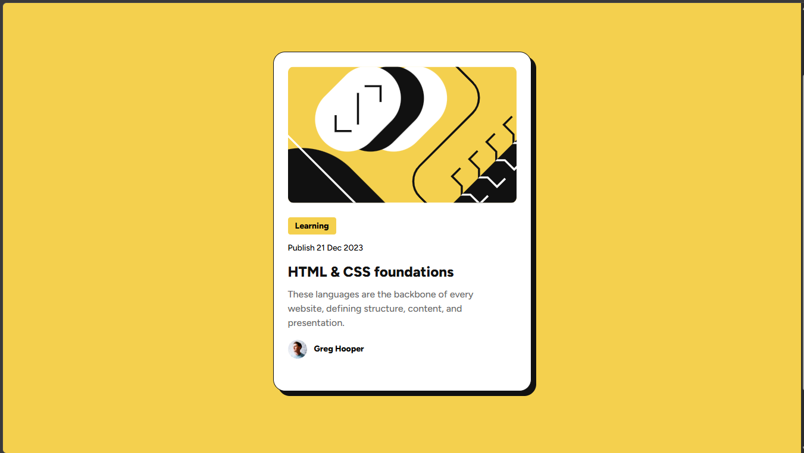

# Frontend Mentor - blog-preview-card 

This is a solution to the testimonial grids section 

## Table of contents

* [Overview](#overview)

  * [Screenshot](#screenshot)
  * [Links](#links)
* [My process](#my-process)

  * [Built with](#built-with)
  * [What I learned](#what-i-learned)
* [Author](#author)

## Overview

### Screenshot

### Links

* Solution URL: [Add solution URL here](https://github.com/Alex-Guar/frontend-mentor-challenges/tree/main/blog-preview-card/)
* Live Site URL: [Add live site URL here](https://alex-guar.github.io/frontend-mentor-challenges/blog-preview-card/)

## My process

### Built with

* Vite
* Semantic HTML5 markup
* CSS custom properties
* Grid
* Flexbox
* Animatios
    -Keyframes
    -view()

The organization of this project is this:

The content of CSS is in the folder SRC.

The CSS has three parts:

1. It has all the values of design such as spaces, colors, and typeface.

2. It has the style of the page.

3. It has the interaction and animations.

Every part has a comment.
### What I learned

## Author

* Frontend Mentor - [@yourusername](https://www.frontendmentor.io/profile/Alex-Guar)
