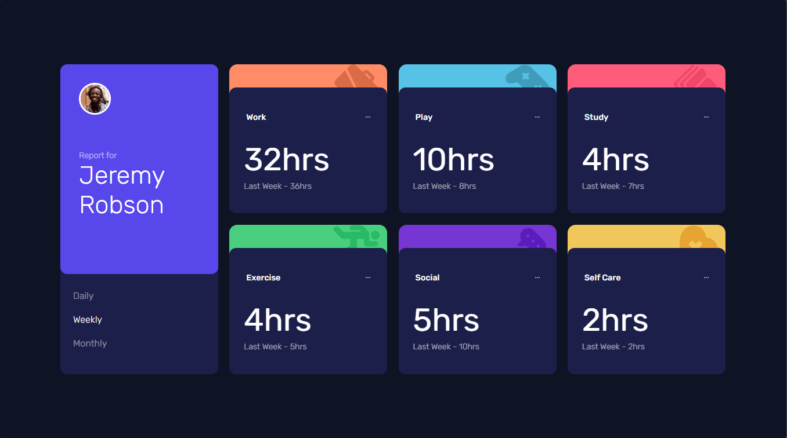

# Frontend Mentor -  time tracking dashboard
 Frontend Mentor challenges help you improve your coding skills by building realistic projects.

## Table of contents

* [Overview](#overview)

  * [Screenshot](#screenshot)
  * [Links](#links)
* [My process](#my-process)
  * [Questions](#questions)
  * [Built with](#built-with)
* [Author](#author)

## Overview

### Screenshot

### Links

* Solution URL: [link](https://github.com/Alex-Guar/frontend-mentor-challenges/tree/main/time-tracking-dashboard/)
* Live Site URL: [link](https://alex-guar.github.io/frontend-mentor-challenges/time-tracking-dashboard/)
* HTML: [link](./index.html)
* CSS: [link](./src/style.css)
* JS: [link](./src/main.js)

## My process

### Built with

* Semantic HTML5 markup
* CSS custom properties
* Flexboxh* Grid
* JS

The project is organised into different folders. The `src` folder contains the CSS styles and JavaScript files.

## Questions

### What are you most proud of, and what would you do differently next time?

I was able to create a more responsive dashboard. 
In future projects, I'm going to experiment with other properties to achieve more interesting results.

### What challenges did you encounter, and how did you overcome them?

In this project, I wanted to control the behaviour of the responsive design,
so I decided to investigate how to control the grid without defining fixed rules.
I found in the documentation that `grid-template-columns`
accepts `repeat()` with `auto-fill`. This was very useful.

### What specific areas of your project would you like help with?

I would appreciate feedback on my JavaScript code for controlling the data.
* Frontend Mentor - [@yourusername](https://www.frontendmentor.io/profile/Alex-Guar)
